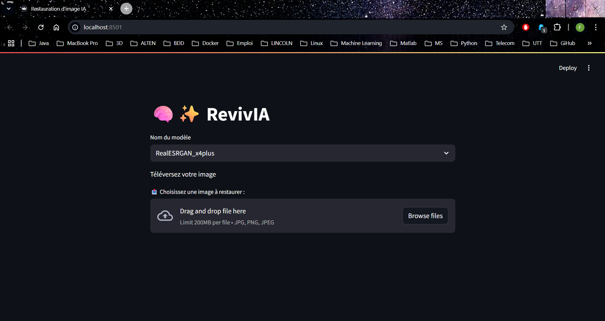
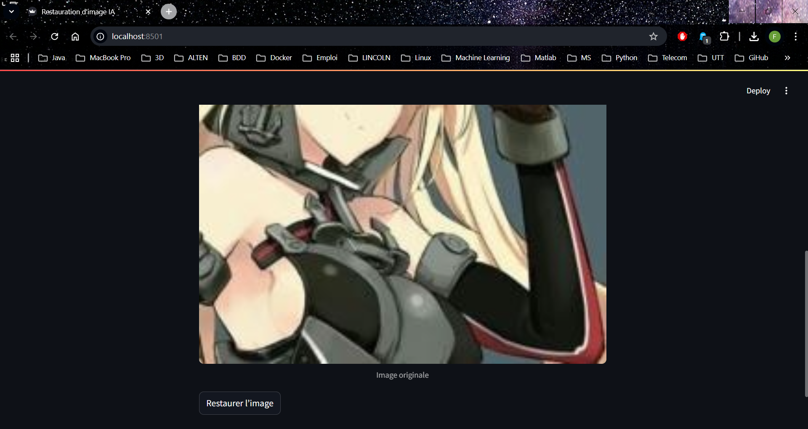
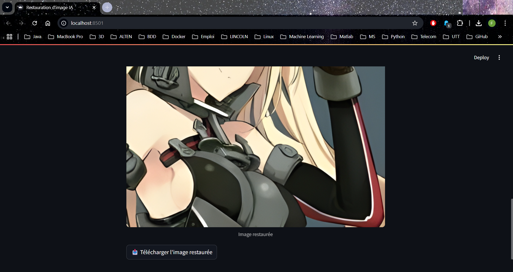
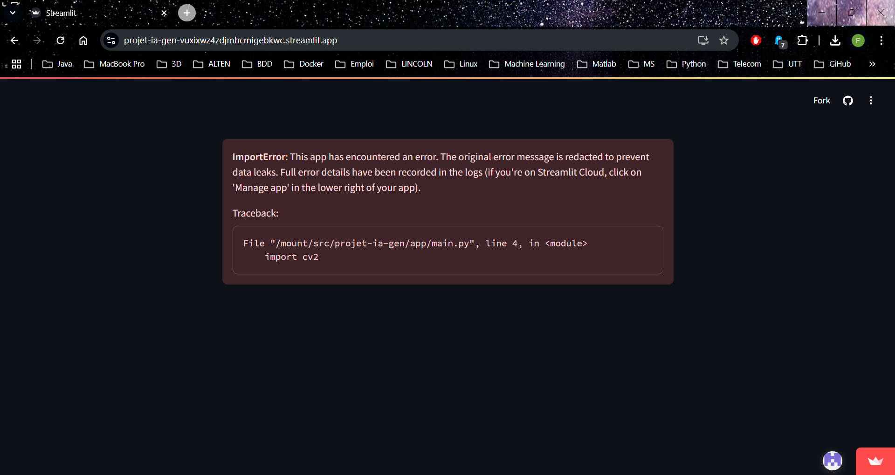

# RevivIA
Une application streamlit permettant d'augmenter la résolution d'une image avec des modèles d'IA générative.

## Installation

**Configuration recommandée**
* Python >= 3.7
* PyTorch >= 1.7

**Etapes**
1. Cloner le repo
```
git clone https://github.com/UTT-GR03/Projet-IA-Gen.git
```

2. Installer les packages
```
cd Projet-IA-Gen
pip install -r requirements.txt
```
3. Sur Windows, si vous avez créer un environnement virtuel Python `venv`, ouvrir le script `.\venv\Lib\site-packages\basicsr\data\degradations.py`.  
A la ligne 8, remplacer cette ligne de code  
```python
from torchvision.transforms.functional_tensor import rgb_to_grayscale
```
par  
```python
from torchvision.transforms.functional import rgb_to_grayscale
```
  
## Exécution
Pour lancer l'application, exécuter cette commande :  
`streamlit run app/main.py`

La fenêtre suivante s'affichera :  



Il suffira ensuite de choisir votre modèle selon l'image dont vous souhaitez augmenter la résolution.  
Téléversez ensuite votre image. Un bouton "Restaurer l'image" apparaîtra en bas de page : 

  

Une fois l'image restaurée, vous pouvez le télécharger :  



## Limitations
### Limitation 1
Le déploiement sur Streamlit Cloud n'a pas abouti.  


Nous n'avons pas réussi à résoudre ce problème.
  
### Limitation 2
Le développement des modèles ESRGAN et SwinIR n'a pas abouti.

### Limitation 3
L'application ne fonctionne pas sur les appareils macOS en raison de problème de dépendances du package `basicsr`.

## Contributions
* Théo LEPÈRE
* Félix LY
* Frank NGNIGUE
* Salomé VIENNET


## Références
* [Real-ESRGAN](https://github.com/xinntao/Real-ESRGAN)
